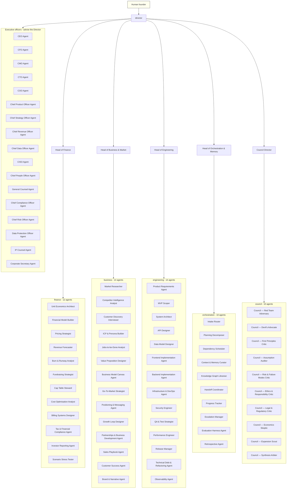

# Organisation Chart

The reporting line is the escalation path. An agent escalates to its `reports_to` and nowhere else;
cross-domain conflicts travel up to the nearest common parent, which is usually the Director.

## Reporting lines

| Agent | Reports to |
|---|---|
| `director` | `human-founder` |
| `business-head` | `director` |
| `council-director` | `director` |
| `engineering-head` | `director` |
| `finance-head` | `director` |
| `orchestration-head` | `director` |
| `ceo-agent` | `director` |
| `cfo-agent` | `director` |
| `chief-compliance-officer-agent` | `director` |
| `chief-data-officer-agent` | `director` |
| `chief-revenue-officer-agent` | `director` |
| `chief-risk-officer-agent` | `director` |
| `chief-strategy-officer-agent` | `director` |
| `chro-agent` | `director` |
| `ciso-agent` | `director` |
| `cmo-agent` | `director` |
| `coo-agent` | `director` |
| `corporate-secretary-agent` | `director` |
| `cpo-agent` | `director` |
| `cto-agent` | `director` |
| `data-protection-officer-agent` | `director` |
| `general-counsel-agent` | `director` |
| `ip-counsel-agent` | `director` |
| `council-assumption-auditor` | `council-director` |
| `council-devils-advocate` | `council-director` |
| `council-economics-skeptic` | `council-director` |
| `council-ethics-and-responsibility` | `council-director` |
| `council-expansion-scout` | `council-director` |
| `council-first-principles` | `council-director` |
| `council-legal-and-regulatory-critic` | `council-director` |
| `council-red-team` | `council-director` |
| `council-risk-and-failure-modes` | `council-director` |
| `council-synthesis-arbiter` | `council-director` |
| `api-designer` | `engineering-head` |
| `backend-implementation-agent` | `engineering-head` |
| `billing-systems-designer` | `finance-head` |
| `brand-narrative-agent` | `business-head` |
| `burn-runway-analyst` | `finance-head` |
| `business-model-canvas-agent` | `business-head` |
| `cap-table-steward` | `finance-head` |
| `competitor-intel-analyst` | `business-head` |
| `context-memory-curator` | `orchestration-head` |
| `cost-optimization-analyst` | `finance-head` |
| `customer-discovery-interviewer` | `business-head` |
| `customer-success-agent` | `business-head` |
| `data-model-designer` | `engineering-head` |
| `dependency-scheduler` | `orchestration-head` |
| `escalation-manager` | `orchestration-head` |
| `evaluation-harness-agent` | `orchestration-head` |
| `financial-model-builder` | `finance-head` |
| `frontend-implementation-agent` | `engineering-head` |
| `fundraising-strategist` | `finance-head` |
| `growth-loop-designer` | `business-head` |
| `gtm-strategist` | `business-head` |
| `handoff-coordinator` | `orchestration-head` |
| `icp-persona-builder` | `business-head` |
| `infra-devops-agent` | `engineering-head` |
| `intake-router` | `orchestration-head` |
| `investor-reporting-agent` | `finance-head` |
| `jtbd-analyst` | `business-head` |
| `knowledge-graph-librarian` | `orchestration-head` |
| `market-researcher` | `business-head` |
| `mvp-scoper` | `engineering-head` |
| `observability-agent` | `engineering-head` |
| `partnership-bd-agent` | `business-head` |
| `performance-engineer` | `engineering-head` |
| `planning-decomposer` | `orchestration-head` |
| `positioning-messaging-agent` | `business-head` |
| `pricing-strategist` | `finance-head` |
| `product-requirements-agent` | `engineering-head` |
| `progress-tracker` | `orchestration-head` |
| `qa-test-strategist` | `engineering-head` |
| `release-manager` | `engineering-head` |
| `retrospective-agent` | `orchestration-head` |
| `revenue-forecaster` | `finance-head` |
| `sales-playbook-agent` | `business-head` |
| `scenario-stress-tester` | `finance-head` |
| `security-engineer` | `engineering-head` |
| `system-architect` | `engineering-head` |
| `tax-and-compliance-finance` | `finance-head` |
| `tech-debt-refactor-agent` | `engineering-head` |
| `unit-economics-architect` | `finance-head` |
| `value-proposition-designer` | `business-head` |

## Who decides what

| Decision | Decided by | Must be reviewed by |
|---|---|---|
| Stage gate: go / no-go / pivot / kill | `director` | Council (verdict required) |
| Strategy and bet allocation | `ceo-agent`, ratified by `director` | `council-first-principles` |
| Any price that ships | `finance-head` | `council-economics-skeptic` |
| Spend above threshold | `cfo-agent` | — |
| Architecture of record | `engineering-head` | `cto-agent`, `ciso-agent` |
| MVP scope line | `mvp-scoper`, approved by `engineering-head` | Council |
| Release go/no-go | `release-manager` | `ciso-agent` (blocking authority) |
| What the organisation remembers | `context-memory-curator` | `orchestration-head` |
| Severity of a Council finding | `council-synthesis-arbiter` | `council-director` |
| Anything needing a licensed attorney | escalated out of the system entirely | `general-counsel-agent` flags it |

## Deliberate constraints

- **One owner.** Every task, artifact, and risk has exactly one accountable agent. Two owners means none.
- **The Council cannot be skipped.** No stage advances without a schema-valid verdict; overruling a blocker
  requires written justification from the `director`.
- **The Council cannot decide.** It attacks and advises; it never approves spend or merges work.
- **Legal advice stops at the boundary.** `general-counsel-agent` and its peers spot issues and draft;
  anything requiring a licensed attorney is escalated out of the system, never answered inside it.
- **Officers advise, heads deliver.** An officer who wants work done raises it to the `director`,
  who assigns it to a head with a budget.
